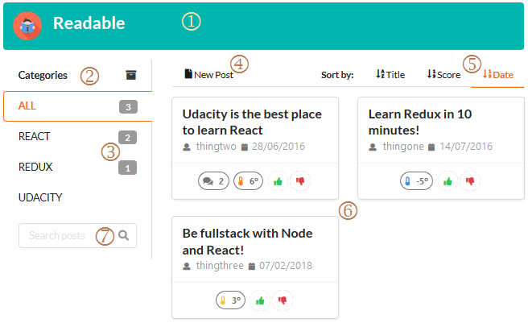
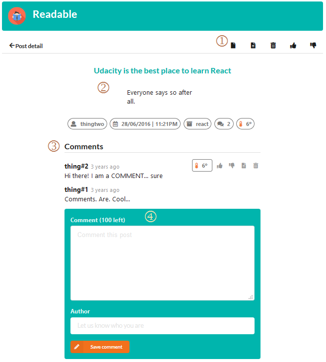
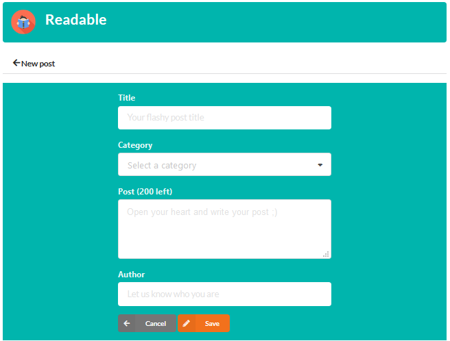
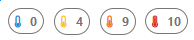

# Readable Frontend

This app is free and colaborative. Requires no authentication or previous registration. You can create, edit and delete any post or comments freely.

There are no moderators. So we ask you to post only positive messages.

## Installation

### Dependencies

To install an start web application, run the following commands in this directory:

```sh
npm install
npm start
```

After few seconds open [http://localhost:3000](http://localhost:3000) in your web browser.

## Views

### Home

See below the **Readable**'s home page:



1) Top bar leads to home page.
2) List of all categories. Clicking in a category will filter posts.
3) Number of posts in each category.
4) Leads to *New post* page where you can write a brand new post.
5) Allow sort posts by title, score or date. Clicking in the same option will toggle order, ascending or descending.
6) Grid with post cards. Each card shows the post title, author, date, score and number of comments.
7) Search by post's title.

### Post detail

Click in any post card to show the **details page**:



1) Controls to Create a new post, Edit, Delete, Up vote or Down vote the current post.
2) Current post details.
3) Post's comments. Hover mouse over a comment to show hidden controls with it's score and buttons to up vote, down vote, edit or delete.
4) Form to add or edit a comment.

### Write post

Click in home page's *New post* button or in post's *Edit* button to open **write page**:



All fields are required.

### Searching posts

You can search posts by title using the text box below categories list in home page:


1) Search text field.
2) Clear search results.

Filter by title works and by category works together. It means that clicking on any categories will show the posts of that category AND with the title searched.

The orange bar appears while the search by title is active. Click in the *Show all* button to clear the filter by title.

### Rating

You can rate any post and comment by clicking in :thumbsup: *Up vote* and :thumbsdown: *Down vote* buttons.

After voting the rating scale changes:



## Known issues

The Comment Form in [Post Detail](#post-detail) have a misbehavior page due to lack of knowledge about Redux.

You can notice it by editing and saving an existing comment and then trying to add a new one.